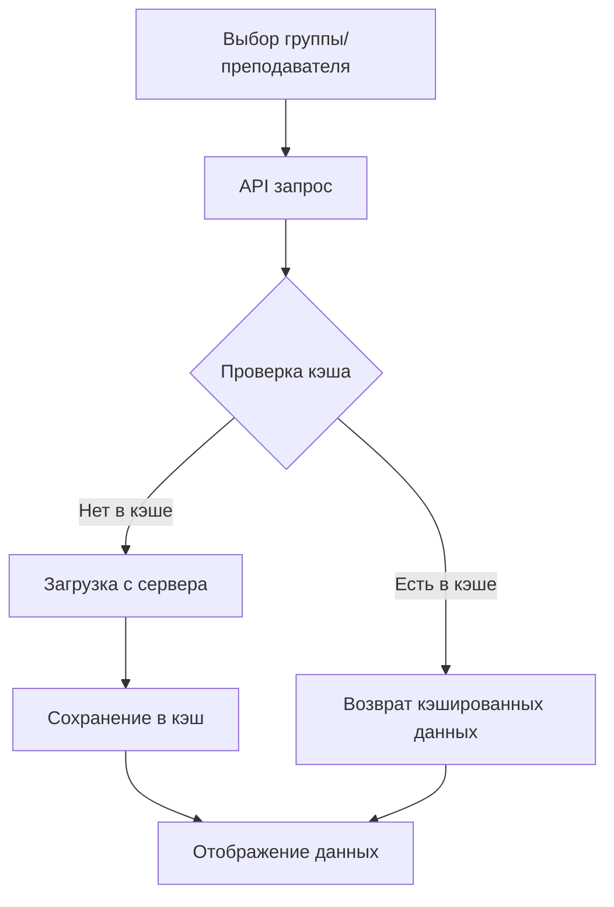
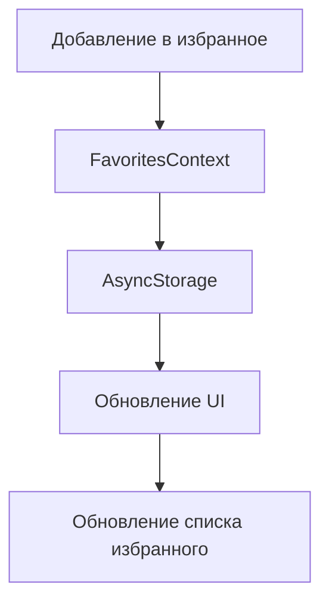
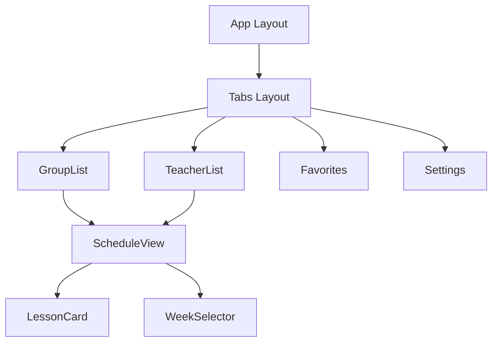

# 🏗 Архитектура приложения

## Общая структура

### Файловая структура
```
app/
├── _layout.tsx              # Корневой layout с провайдерами
├── (tabs)/                  # Основные экраны в табах
│   ├── _layout.tsx         # Настройка навигации по табам
│   ├── index.tsx           # Список групп
│   ├── teacher.tsx         # Список преподавателей
│   ├── favorites.tsx       # Избранное
│   └── settings.tsx        # Настройки
├── schedule/               # Экраны расписания
│   └── [id].tsx           # Динамический роут расписания группы
└── teacher/                # Экраны преподавателей
    └── [id].tsx           # Динамический роут расписания преподавателя

components/                 # Переиспользуемые компоненты
├── GroupList.tsx          # Список групп
├── TeacherList.tsx        # Список преподавателей
├── ScheduleView.tsx       # Отображение расписания
├── LessonCard.tsx         # Карточка занятия
└── WeekSelector.tsx       # Выбор недели

contexts/                  # React контексты
├── FavoritesContext.tsx   # Управление избранным
├── ThemeContext.tsx       # Управление темой
└── ScheduleSettingsContext.tsx # Настройки расписания
```

## Навигация

### Структура роутинга
```typescript
type RootStackParamList = {
  '(tabs)': undefined;
  'info': undefined;
  'schedule/[id]': { id: string };
  'teacher/[id]': { id: string };
};
```

### Схема навигации
```
Root
├── (tabs)
│   ├── index (Группы)
│   ├── teacher (Преподаватели)
│   ├── favorites (Избранное)
│   └── settings (Настройки)
├── schedule/[id] (Расписание группы)
├── teacher/[id] (Расписание преподавателя)
└── info (Информация)
```

## Управление состоянием

### Контексты

#### FavoritesContext
Управление избранными элементами:
```typescript
interface FavoritesContextType {
  favorites: FavoriteItem[];
  addToFavorites: (item: GroupInfo | TeacherInfo, type: 'group' | 'teacher') => Promise<void>;
  removeFromFavorites: (id: number, type: 'group' | 'teacher') => Promise<void>;
  isFavorite: (id: number, type: 'group' | 'teacher') => boolean;
}
```

#### ThemeContext
Управление темой оформления:
```typescript
interface ThemeContextType {
  isDarkTheme: boolean;
  useSystemTheme: boolean;
  toggleTheme: () => Promise<void>;
  toggleSystemTheme: () => Promise<void>;
}
```

#### ScheduleSettingsContext
Настройки отображения расписания:
```typescript
interface ScheduleSettings {
  showCabinetNumbers: boolean;
  showTeacherNames: boolean;
  compactMode: boolean;
  showLessonNumbers: boolean;
}
```

## Потоки данных

### Загрузка расписания


### Управление избранным


## Компонентная архитектура

### Основные компоненты

#### ScheduleView
- Отображение расписания
- Обработка состояний загрузки
- Группировка по дням
- Интеграция с WeekSelector

#### GroupList/TeacherList
- Отображение списков
- Поиск и фильтрация
- Оптимизация производительности
- Интеграция с FavoritesContext

#### LessonCard
- Отображение информации о занятии
- Адаптивный дизайн
- Интеграция с ScheduleSettingsContext

## Взаимодействие компонентов



## Хранение данных

### AsyncStorage
- Избранное
- Настройки темы
- Настройки отображения
- Кэш расписания

### Кэширование
```typescript
interface CacheItem<T> {
  data: T;
  timestamp: number;
  expiry: number;
}
```

## Оптимизация

### Стратегии
1. Мемоизация компонентов
2. Виртуализация списков
3. Кэширование данных
4. Ленивая загрузка изображений

### Производительность
```typescript
// Пример оптимизации списка
const MemoizedItem = React.memo(({ item }) => (
  <View>
    <Text>{item.name}</Text>
  </View>
));

const VirtualizedList = () => (
  <FlatList
    data={items}
    renderItem={({ item }) => <MemoizedItem item={item} />}
    getItemLayout={(data, index) => ({
      length: ITEM_HEIGHT,
      offset: ITEM_HEIGHT * index,
      index,
    })}
  />
);
```

## Безопасность

### Защита данных
- Валидация входных данных
- Санитизация данных
- Безопасное хранение

### Обработка ошибок
```typescript
try {
  const data = await api.fetchSchedule();
} catch (error) {
  if (error instanceof NetworkError) {
    // Обработка сетевых ошибок
  } else if (error instanceof ValidationError) {
    // Обработка ошибок валидации
  }
}
```

## Масштабируемость

### Добавление новых функций
1. Создание нового компонента
2. Интеграция с существующими контекстами
3. Добавление новых роутов
4. Обновление типов

### Модификация существующего функционала
1. Изменение интерфейсов
2. Обновление компонентов
3. Миграция данных
4. Обновление документации